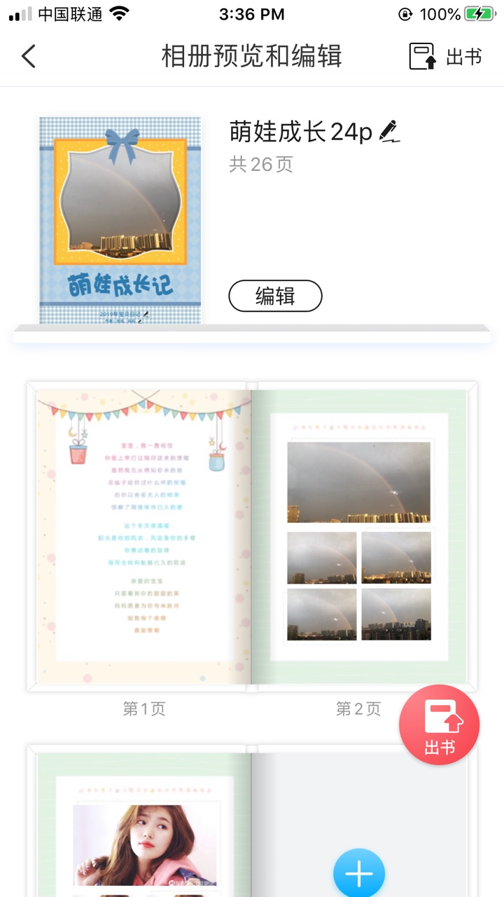

### 记一个复杂页面的内存优化之路

之前做的一个内存占用很高的页面，做了很多优化，记录一下。



家庭时光集预览页是整个时光集的制作入口，需要展示全部制作的页面元素，对性能要求很高。刚开始做完这个页面时，内存消耗要到100M+，多次进入内存还会一直增长，会导致crash。经过持续优化，目前在非首次进入页面时内存只增长5M，多次进入也不会更多增长。如何实现的呢？请看下面讲解。
 
##### 展示方案

刚开始写这个页面，使用地是制作页面的view，view有多个视图层级，背景图，多个图片，一个view整体内存要占20M左右，在有cell复用的情况下也要消耗一百多M，这样肯定内存消耗太高了，如果降低内存占用呢？

当时主要考虑是将view换成一个image，一个图片占用的内存肯定小多了，怎么变成图片呢？

要是服务器能转化成图片下发下来就好了！可惜先不提服务器是否可以支持，时光集在无网时也有一定制作能力，此时数据都在本地存储，还没有上传服务器，但是预览页也是需要更新展示的，根本不能满足需求。

这样只能客户端本地来做处理了。如何处理呢，有两个方案，一个是预览页单独做一次绘制，子线程拉取数据，绘制成image，优点在于绘制过程可控性强，缺点在于再写一次制作布局，复杂度也挺高。第二个就是在现有view渲染完成后把view变成image，替换处理，优点在于复用现有布局处理，缺点在于渲染过程不够可控，如何知道当前view渲染完成呢。

最后选择了第二种方案，view转image，复用现有布局代码。主要考虑布局细节也在调整中，复用一套，后续预览页不需要再单独维护。

##### 截图时机的选择

一个制作页面的元素分为可编辑和不可编辑元素，不可编辑元素分为底图，装饰图，可编辑元素分为文本，图片，音频，视频元素。必须等每个元素加载完成才可以，每种元素的完成时机
具体来讲：
	
	文本元素
		设置完text算完成
	音频元素
		设置完时长状态算完成
	视频元素\图片元素
		网络图
			图片下载完成并setImage后算完成
		本地图片 
			setImage后算完成
根据这个做了一套通知处理机制，每一个元素加载完成，通知一下外层容器view，外层的容器view会判断所有元素都加载完成才做image转换。

可惜并没有这么简单，这样得到的image经常会发现图片空白，有背景图没有用户自己添加的图片，是偶现的一个问题。怀疑是预览页vc不显示时触发截图转换,也可能是view已经从cell上remove掉。

1. 为了规避父视图不存在时刷新，截图转化时做了父视图是否存在的判断，同时在加回到父视图上是再检查是否需要截图。

	```
	- (void)didMoveToSuperview {
	    [super didMoveToSuperview];
	    if (!self.previewImage) {
	        [self checkLoadStatus];
	    }
	}
	```

2. 经过多次排查，发现一个复现场景，

	场景 previewVC -> uploadingVC -> checkVC,其中uploadingVC进入checkVC后，需要把自己关闭，这样再退出，就到了previewVC。 当时采用的方法是
	
	```
	 UINavigationController *nav = self.navigationController;
	 [nav popViewControllerAnimated:NO];
	 [nav pushViewController:controller animated:YES];
	```
	这样运行起来看着没问题，实际上预览页会漏出来一下，触发UI的刷新，此时截图就会出现空白。
	
	```
	[nav pushViewController:controller animated:YES];
	    
	NSMutableArray *viewControllers = [[NSMutableArray alloc] initWithArray:self.navigationController.viewControllers];
	if ([viewControllers containsObject:self]) {
	    [viewControllers removeObject:self];
	    self.navigationController.viewControllers = [viewControllers copy];
	}
	```
	这样就不会再出现页面跳转时触发刷新的问题，同时把其他页面类似的处理都换成了这种方式。
3. 可惜虽然出现概率降低了很多，但是依然会有复现，复现的都是本地图片，用户添加完本地图片后，预览页没有显示出来。想象一下，如果用户在预览页快速滑动一下，然后跳转到下一个页面，此时一个view也许已经满足转换条件，但是vc并没有显示，setimage并不等于渲染完成，渲染完成并不清楚什么时机
	
	关于UIImageView渲染，可以参见[将像素绘制到屏幕上去](https://objccn.io/issue-3-1/)
	
	```
	我们只是简单的将位图数据以图片的形式传给了 UIImageView，然后 UIImageView 传给了 Core Animation，然后轮流传给渲染服务。
	```
目前最后采用的方案改为判断vc已显示，父视图可以追溯到window，都满足时才截图，暂无复现图片空白问题。

	```
	- (BOOL)allowConvertToImage {
	    if (!self.superview) {
	        return NO;
	    }
	    BOOL hasWindow = NO;
	    UIView *superView = self.superview;
	    while (superView != nil) {
	        if ([superView isKindOfClass:[UIWindow class]]) {
	            hasWindow = YES;
	            break;
	        }
	        superView = superView.superview;
	    }
	    
	    BOOL hasShownController = NO;
	    UIResponder *nextResponder = self.nextResponder;
	    while (nextResponder != nil) {
	        if ([nextResponder isKindOfClass:[SZYViewController class]]) {
	            hasShownController = [(SZYViewController *)nextResponder isViewDidAppearOnScreen];
	            break;
	        }
	        nextResponder = nextResponder.nextResponder;
	    }
	    return hasWindow && hasShownController;
	}
	```

##### 转换图片

```
- (UIImage *)convertViewToImage:(UIView *)view {
    UIImage *imageRet = [[UIImage alloc]init];
    @autoreleasepool {
        CGRect rect = CGRectMake(0, 0, ceil(view.size.width), ceil(view.size.height));
        UIGraphicsBeginImageContextWithOptions(rect.size, YES, [UIScreen mainScreen].scale);
        CGContextRef context = UIGraphicsGetCurrentContext();
        CGContextSetFillColorWithColor(context, [[UIColor colorWithRGB:0xFFFFFF] CGColor]);
        CGContextFillRect(context, rect);
        [view.layer renderInContext:context];
        imageRet = UIGraphicsGetImageFromCurrentImageContext();
        UIGraphicsEndImageContext();
    }
    if (![self allowConvertToImage]) {
        return nil;
    }
    return imageRet;
}
```
把view转换成image，需要注意的

第一点是scale设置成当前设备的scale，不然高倍屏幕上会模糊，

第二点是背景色需要设置一下，不然可能出现黑色边缘

第三点 尺寸设置做了向上取整，不然可能会出现像素级偏差的展示问题

##### 内存分析

1. 加了日志，可以看到那些view被转换成了image
2. 使用Instrument分析了内存占用情况，内存占用大概在50-60m，还有哪里占用了这么多内存呢，Instrument里面可以看到一个是SDImageDecoder,另外一个是截图后的image，可能有20多个，占用也不小。

##### 图片解码

1. 之前图片展示使用的格式是webp，其实用户上传的图片都是png，jpg格式，webp解码占用资源比较多，所以换成了jpg格式展示
2. 预览页展示图片比较小，所以请求图片时设置了小一些地分辨率，会节省一些资源
3. 因为图片展示用的SDWebImage,调整了缓存策略，不用内存缓存

但是全部图片设置全后大概50多张图片，SDWebImage这里还是会占用20M左右，再想处理只能自己来加载或者修改源码了。

##### 图片存储和管理

刚才提到view转化的image也需要处理下，刚开始直接保存到内存里，这样24个image占用资源也不少

后来改成写入文件，需要展示时，`[UIImage imageWithContentsOfFile:path]`这种方式读取图片，也能节约不少内存


##### 数据更新

要是某一页数据用户经过了编辑更新，截图就需要重新生成，这里做了数据比对，不管是本地编辑更新，还是服务器数据有更新，都会发现差异，重新使用view加载，再截图一次

##### 总结

经过以上不断优化，最后完全展示的预览页会占用20m内存，非首次进入预览页，只会增加3~5M内存大小。

20M占用的主要是SDWebImage加载图片，不能及时释放。

当然中间会有一些内存峰值达到50M甚至100M，主要是多个page的view同时加载，等view加载完成转化为image，峰值就会降下来。

